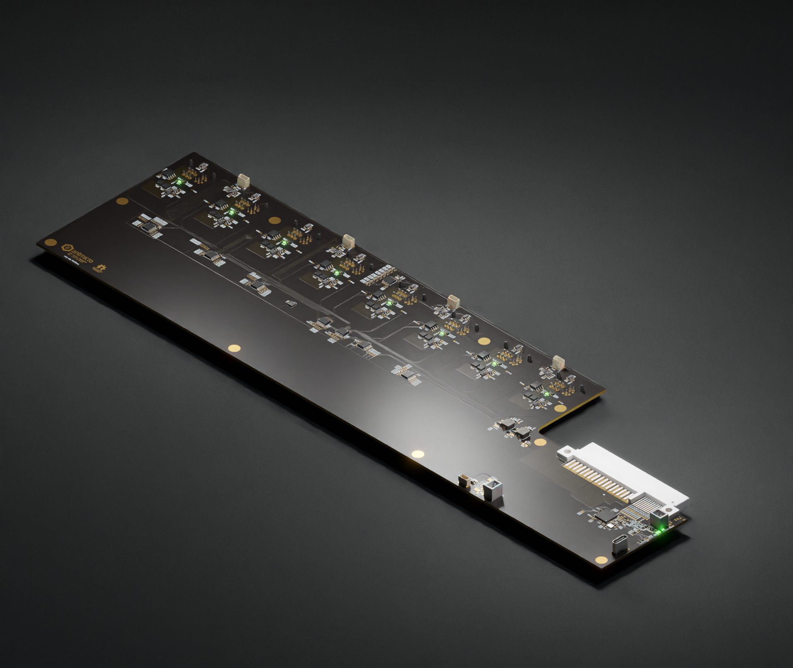

# GPU cluster backplane

Copyright (c) 2023-2024 [Antmicro](https://www.antmicro.com)

## Overview

This project contains open hardware design files for a PCB supporting power distribution in a cluster composed of GPUs.
This board has been derived from an open source [d166-e-psu-breakout](https://github.com/antmicro/d1600e-psu-breakout) created by Antmicro.
The GPU cluster backplane has been designed to be used with up to eight GPU units connected over a series [thunderbolt-gpu-adapters](https://github.com/antmicro/thunderbolt-gpu-adapter).
The design files for the board were prepared in KiCad 7.x.

## Key features

* Power supply distribution between eight expansion slots
* Built-in circuitry for driving cooling fans for the GPUs

## Project structure 

The main directory contains KiCad PCB project files, a LICENSE and a README.
The remaining files are stored in the following directories: 

* `img` - contains graphics for this README
* `doc` - contains board schematics in PDF format
* `assets` - contains visual assets for showcasing this design on [Open Hardware Portal](https://openhardware.antmicro.com) 

## License

This project is published under the [Apache-2.0](LICENSE) license.
